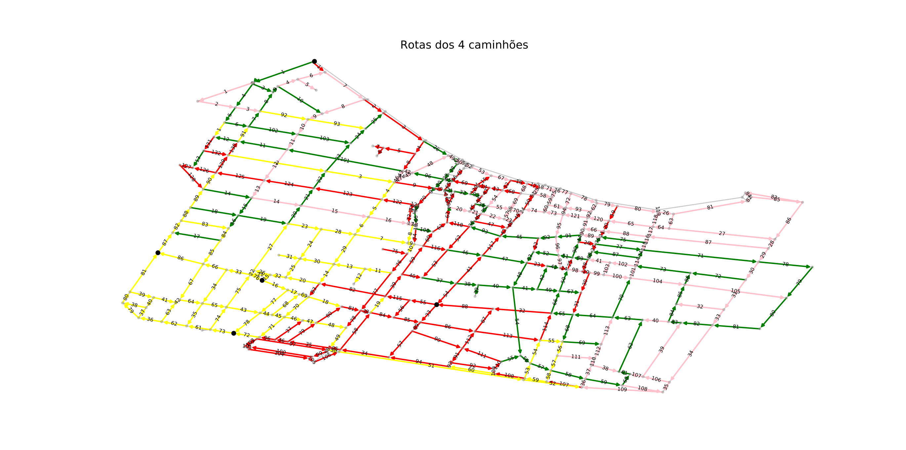

# Roteamento de coleta de lixo

## Introdução
O vigente projeto é a aplicação de algoritmo genético pra criar uma solução computacional pra o roteamento de caminhos compactadores (de lixo) pra coleta de resíduos sólidos.

Para isso criou-se um fluxo de trabalho que segue como demonstrado abaixo:
1. Josm (edição)
1. OSMNX (Gerar instancia) 
1. UHGS (gerar/otimizar rotas) 
1. Network Matplotlib (visualizar rotas)

E ao fim, utilizando estes procedimentos, conseguimos o seguinte resultado:

Cada cor representa a rota de um determinado caminhão de lixo.

---

## Instalação

### Gerador de instância

1. Instalar [Anaconda](https://docs.anaconda.com/anaconda/install/).

    ```
    conda config --prepend channels conda-forge
    conda create -n ox --strict-channel-priority osmnx==0.16.1
    ```
1. git clone https://github.com/1jpaulo/roteamento-coleta-lixo.git

1. ```python3 gera_instancia.py```

---

### Algoritmo genético para roteamento
1. Clonar [HGS-CARP](https://github.com/vidalt/HGS-CARP):
    1. Gerar executável `gencarp` com [make](https://www.gnu.org/software/make/) e compilador C++
    1. Gerar rotas segundo [instruções](https://github.com/vidalt/HGS-CARP/blob/master/README.pdf).